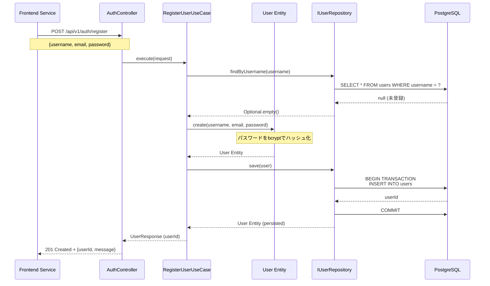
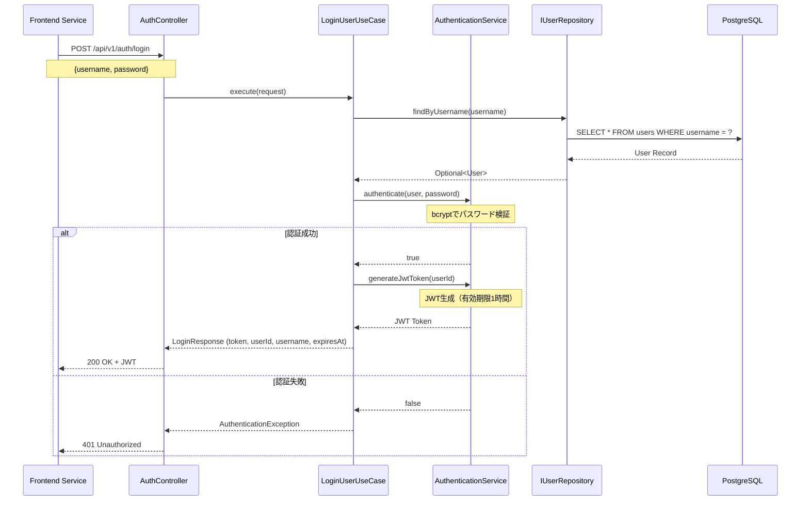
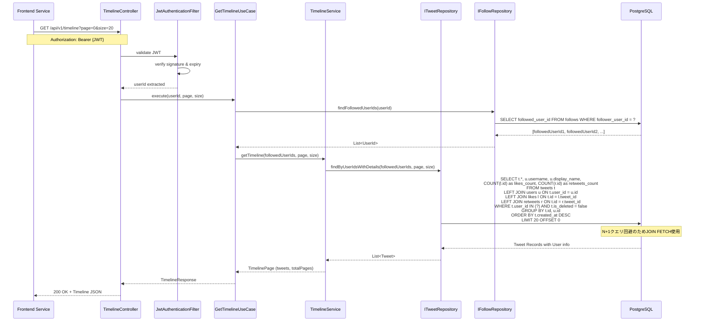
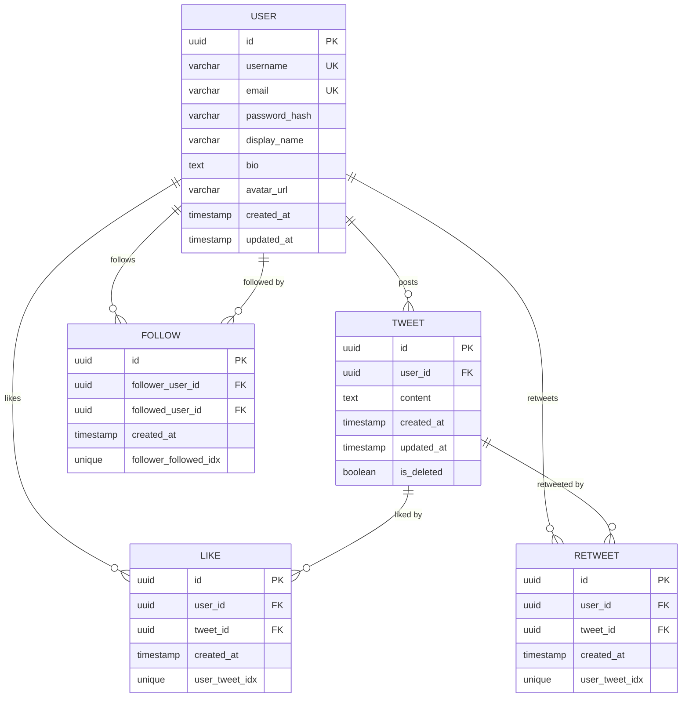

# Design Document: chirper-backend

## Overview

chirper-backendは、Twitter風SNSアプリケーション「Chirper」のバックエンドサービスとして、ビジネスロジックとデータ永続化を担うREST APIサーバーです。Spring Boot 3.xとオニオンアーキテクチャを採用し、ドメイン駆動設計の原則に基づいて構築されます。

**Purpose**: ユーザー管理、ツイート管理、タイムライン、ソーシャル機能のビジネスロジックをREST APIとして提供し、フロントエンドサービスからの安全で高速なデータアクセスを実現する。

**Users**: フロントエンドサービス（chirper-frontend）が主要なクライアントとして、Webブラウザ経由でエンドユーザーにサービスを提供する。将来的にモバイルアプリケーションからの直接アクセスも想定される。

**Impact**: 新規システムとして、認証、ツイート投稿、タイムライン表示、ソーシャル機能（フォロー、いいね、リツイート）、検索機能を提供する。親プロジェクトのアーキテクチャ設計に従い、オニオンアーキテクチャを実装することで、保守性とテスタビリティの高いシステムを構築する。

### Goals

- オニオンアーキテクチャによる明確な責務分離とドメイン駆動設計の実現
- JWT認証による安全なステートレス認証基盤の構築
- RESTful API設計原則に基づく一貫性のあるインターフェース提供
- N+1クエリ問題を回避した高速なタイムライン取得（95パーセンタイル500ms以下）
- 単体テストカバレッジ95%以上の達成による高品質なコードベース

### Non-Goals

- フロントエンド実装（chirper-frontendが担当）
- リアルタイム通知機能（WebSocket/SSE）— Phase 2で検討
- 画像アップロード機能 — Phase 2で検討
- ダイレクトメッセージ機能 — Phase 2で検討
- トレンド分析機能 — Phase 2で検討
- マルチリージョン展開 — 初期段階では単一リージョンで運用

## Architecture

### Existing Architecture Analysis

親プロジェクト（multi-repo/docs/michi/chirper）でオニオンアーキテクチャが定義されており、Backend ServiceとFrontend Serviceの両方で統一されたアーキテクチャパターンを採用する方針が確立されている。

**親プロジェクトで定義された制約**:
- 4層構造: Domain、Application、Infrastructure、Presentation
- 依存関係の方向: 外側→内側（内側は外側に依存しない）
- Repository InterfaceはDomain層で定義、Infrastructure層で実装（依存性逆転の原則）
- Domain層は純粋なJavaクラス（外部依存なし）

**Backend Serviceとして遵守すべきアーキテクチャ原則**:
- ビジネスロジックとビジネスルールはDomain層に集約
- Application層でトランザクション制御とユースケース実装
- Infrastructure層でJPA/Hibernate、外部サービス連携を実装
- Presentation層でREST Controllerとリクエスト/レスポンスモデルを実装

### Architecture Pattern & Boundary Map

```mermaid
graph TB
    subgraph "Presentation Layer - 外部インターフェース"
        AuthController[AuthController]
        UserController[UserController]
        TweetController[TweetController]
        TimelineController[TimelineController]
        SocialController[SocialController]
        SearchController[SearchController]
        JwtFilter[JwtAuthenticationFilter]
        ExceptionHandler[GlobalExceptionHandler]
    end

    subgraph "Application Layer - ユースケース"
        RegisterUserUseCase[RegisterUserUseCase]
        LoginUserUseCase[LoginUserUseCase]
        UpdateProfileUseCase[UpdateProfileUseCase]
        CreateTweetUseCase[CreateTweetUseCase]
        DeleteTweetUseCase[DeleteTweetUseCase]
        GetTimelineUseCase[GetTimelineUseCase]
        FollowUserUseCase[FollowUserUseCase]
        LikeTweetUseCase[LikeTweetUseCase]
        RetweetUseCase[RetweetUseCase]
        SearchUseCase[SearchUseCase]
    end

    subgraph "Domain Layer - ビジネスロジック（中核）"
        User[User Entity]
        Tweet[Tweet Entity]
        Follow[Follow Entity]
        Like[Like Entity]
        Retweet[Retweet Entity]

        UserId[UserId VO]
        TweetId[TweetId VO]
        Email[Email VO]
        Username[Username VO]
        TweetContent[TweetContent VO]
        Password[Password VO]

        TimelineService[TimelineService]
        FollowService[FollowService]
        AuthService[AuthenticationService]

        IUserRepo[IUserRepository]
        ITweetRepo[ITweetRepository]
        IFollowRepo[IFollowRepository]
        ILikeRepo[ILikeRepository]
        IRetweetRepo[IRetweetRepository]
    end

    subgraph "Infrastructure Layer - 外部依存"
        UserRepoImpl[UserRepositoryImpl]
        TweetRepoImpl[TweetRepositoryImpl]
        FollowRepoImpl[FollowRepositoryImpl]
        LikeRepoImpl[LikeRepositoryImpl]
        RetweetRepoImpl[RetweetRepositoryImpl]

        UserJpaEntity[UserJpaEntity]
        TweetJpaEntity[TweetJpaEntity]
        FollowJpaEntity[FollowJpaEntity]
        LikeJpaEntity[LikeJpaEntity]
        RetweetJpaEntity[RetweetJpaEntity]

        JpaSpringDataRepo[Spring Data JPA Repository]
        FlywayMigration[Flyway Migration]
    end

    subgraph "External Systems"
        PostgreSQL[(PostgreSQL Database)]
    end

    AuthController --> RegisterUserUseCase
    AuthController --> LoginUserUseCase
    UserController --> UpdateProfileUseCase
    TweetController --> CreateTweetUseCase
    TweetController --> DeleteTweetUseCase
    TimelineController --> GetTimelineUseCase
    SocialController --> FollowUserUseCase
    SocialController --> LikeTweetUseCase
    SocialController --> RetweetUseCase
    SearchController --> SearchUseCase

    RegisterUserUseCase --> User
    RegisterUserUseCase --> IUserRepo
    LoginUserUseCase --> AuthService
    LoginUserUseCase --> IUserRepo
    CreateTweetUseCase --> Tweet
    CreateTweetUseCase --> ITweetRepo
    GetTimelineUseCase --> TimelineService
    GetTimelineUseCase --> ITweetRepo
    GetTimelineUseCase --> IFollowRepo
    FollowUserUseCase --> FollowService
    FollowUserUseCase --> IFollowRepo

    UserRepoImpl -.implements.-> IUserRepo
    TweetRepoImpl -.implements.-> ITweetRepo
    FollowRepoImpl -.implements.-> IFollowRepo
    LikeRepoImpl -.implements.-> ILikeRepo
    RetweetRepoImpl -.implements.-> IRetweetRepo

    UserRepoImpl --> UserJpaEntity
    TweetRepoImpl --> TweetJpaEntity
    FollowRepoImpl --> FollowJpaEntity
    LikeRepoImpl --> LikeJpaEntity
    RetweetRepoImpl --> RetweetJpaEntity

    UserJpaEntity --> JpaSpringDataRepo
    TweetJpaEntity --> JpaSpringDataRepo
    FollowJpaEntity --> JpaSpringDataRepo
    LikeJpaEntity --> JpaSpringDataRepo
    RetweetJpaEntity --> JpaSpringDataRepo

    JpaSpringDataRepo --> PostgreSQL
    FlywayMigration --> PostgreSQL

    style User fill:#ffeb3b
    style Tweet fill:#ffeb3b
    style Follow fill:#ffeb3b
    style Like fill:#ffeb3b
    style Retweet fill:#ffeb3b
    style TimelineService fill:#ffeb3b
    style FollowService fill:#ffeb3b
    style AuthService fill:#ffeb3b
    style IUserRepo fill:#ffeb3b
    style ITweetRepo fill:#ffeb3b
    style IFollowRepo fill:#ffeb3b
    style ILikeRepo fill:#ffeb3b
    style IRetweetRepo fill:#ffeb3b
```



**Architecture Integration**:
- **Selected pattern**: オニオンアーキテクチャ — 親プロジェクトで採用決定済み、ドメイン駆動設計の原則に基づく
- **Domain/feature boundaries**:
  - ユーザー管理: User Entity、Authentication Service
  - ツイート管理: Tweet Entity、Timeline Service
  - ソーシャル機能: Follow/Like/Retweet Entities、Follow Service
- **Existing patterns preserved**: 親プロジェクトで定義された依存関係の方向（外側→内側）を厳格に遵守
- **New components rationale**:
  - AuthenticationService: パスワード検証とJWT生成の複雑なロジックをカプセル化
  - TimelineService: フォローユーザーのツイート取得とN+1クエリ対策を実装
  - FollowService: フォロー関係の妥当性検証（自分自身をフォローしない等）
- **Steering compliance**: 親プロジェクトのアーキテクチャ設計原則に完全準拠

### Technology Stack

| Layer | Choice / Version | Role in Feature | Notes |
|-------|------------------|-----------------|-------|
| Backend Framework | Spring Boot 3.4.13 | REST APIサーバーの基盤フレームワーク | 親プロジェクトとの整合性を優先。将来的に3.5.xへのアップグレードを検討 |
| Language | Java 21 LTS | アプリケーション開発言語 | 長期サポート版を採用 |
| Persistence | Spring Data JPA 3.3.x | データアクセス抽象化レイヤー | Repository実装の簡素化 |
| ORM | Hibernate 6.5.x | O/Rマッピング | Spring Data JPAに含まれる |
| Database | PostgreSQL 17.x | データ永続化 | オープンソース、ACID準拠、高性能 |
| Migration | Flyway 10.x | データベースマイグレーション管理 | SQLベースのシンプルな管理 |
| Security | Spring Security 6.3.x | 認証・認可フレームワーク | Spring Bootに統合 |
| JWT | jjwt 0.13.0 | JWT生成・検証ライブラリ | 柔軟性とカスタマイズ性を優先 |
| Connection Pool | HikariCP 5.x | データベース接続プール | Spring Boot標準、高性能 |
| Testing | JUnit 5, Mockito, TestContainers | 単体テスト、統合テスト | Spring Boot Test Starterに含まれる |
| Build Tool | Gradle 8.x | ビルド自動化 | 親プロジェクトの推奨ツール |

**技術選定の根拠**:
- Spring Boot 3.4.13: 親プロジェクトとの整合性を保ちつつ、安定版を採用。オープンソースサポート終了を考慮し、3.5.xへのアップグレードパスを設計に含める
- jjwt 0.13.0: Spring Securityのビルトイン機能と比較して、トークンのカスタマイズ性が高く、実績が豊富
- PostgreSQL 17.x: ACID特性、インデックス最適化、JSON型サポート、成熟したエコシステム
- Flyway: Liquibaseと比較してシンプルで学習コストが低く、SQLファイルベースで可読性が高い

詳細な調査結果は `research.md` を参照。

## System Flows

### ユーザー登録・認証フロー



### ログインフロー



### タイムライン取得フロー



## Requirements Traceability

| Requirement | Summary | Components | Interfaces | Flows |
|-------------|---------|------------|------------|-------|
| 1.1, 1.2 | ユーザー登録 | RegisterUserUseCase, User Entity, IUserRepository | POST /api/v1/auth/register | ユーザー登録フロー |
| 1.3, 1.4 | ユーザー認証 | LoginUserUseCase, AuthenticationService, IUserRepository | POST /api/v1/auth/login | ログインフロー |
| 1.5 | パスワードハッシュ化 | Password VO, AuthenticationService | N/A | N/A |
| 1.6 | JWT有効期限 | AuthenticationService | N/A | N/A |
| 1.7 | プロフィール更新 | UpdateProfileUseCase, User Entity, IUserRepository | PUT /api/v1/users/profile | N/A |
| 2.1, 2.2 | ツイート投稿 | CreateTweetUseCase, Tweet Entity, ITweetRepository | POST /api/v1/tweets | N/A |
| 2.3 | ツイート取得 | Tweet Entity, ITweetRepository | GET /api/v1/tweets/{tweetId} | N/A |
| 2.4, 2.5, 2.6 | ツイート削除 | DeleteTweetUseCase, Tweet Entity, ITweetRepository | DELETE /api/v1/tweets/{tweetId} | N/A |
| 3.1, 3.2, 3.3, 3.4, 3.5, 3.6, 3.7 | タイムライン機能 | GetTimelineUseCase, TimelineService, ITweetRepository, IFollowRepository | GET /api/v1/timeline | タイムライン取得フロー |
| 4.1, 4.2, 4.3, 4.4 | フォロー機能 | FollowUserUseCase, FollowService, Follow Entity, IFollowRepository | POST /api/v1/users/{userId}/follow, DELETE /api/v1/users/{userId}/follow | N/A |
| 4.5, 4.6, 4.7 | いいね機能 | LikeTweetUseCase, Like Entity, ILikeRepository | POST /api/v1/tweets/{tweetId}/like, DELETE /api/v1/tweets/{tweetId}/like | N/A |
| 4.8, 4.9, 4.10 | リツイート機能 | RetweetUseCase, Retweet Entity, IRetweetRepository | POST /api/v1/tweets/{tweetId}/retweet, DELETE /api/v1/tweets/{tweetId}/retweet | N/A |
| 5.1, 5.2, 5.3, 5.4 | 検索機能 | SearchUseCase, IUserRepository, ITweetRepository | GET /api/v1/search?query={keyword} | N/A |
| 6.1, 6.2, 6.3, 6.4, 6.5, 6.6, 6.7, 6.8 | セキュリティ | JwtAuthenticationFilter, GlobalExceptionHandler, Bean Validation | N/A | JWT認証フロー |
| 7.1, 7.2, 7.3, 7.4, 7.5, 7.6, 7.7 | オニオンアーキテクチャ | Domain/Application/Infrastructure/Presentation層の全コンポーネント | N/A | N/A |
| 8.1, 8.2, 8.3, 8.4, 8.5, 8.6, 8.7, 8.8, 8.9, 8.10 | データベース設計 | JPA Entities, Flyway Migration, PostgreSQL | N/A | N/A |
| 9.1, 9.2, 9.3, 9.4, 9.5 | パフォーマンス | HikariCP設定, TimelineService (N+1対策), ページネーション | N/A | タイムライン取得フロー |
| 10.1, 10.2, 10.3, 10.4, 10.5, 10.6, 10.7 | 可用性・保守性 | Spring Boot Actuator, Logback設定, テスト | /actuator/health | N/A |
| 11.1-11.15 | API仕様 | Presentation層の全Controller | 全REST APIエンドポイント | 全フロー |

## Components and Interfaces

### Summary Table

| Component | Domain/Layer | Intent | Req Coverage | Key Dependencies (P0/P1) | Contracts |
|-----------|--------------|--------|--------------|--------------------------|-----------|
| AuthController | Presentation | 認証・認可APIエンドポイント | 1.1-1.4 | RegisterUserUseCase (P0), LoginUserUseCase (P0) | API |
| UserController | Presentation | ユーザー管理APIエンドポイント | 1.7 | UpdateProfileUseCase (P0) | API |
| TweetController | Presentation | ツイート管理APIエンドポイント | 2.1-2.6 | CreateTweetUseCase (P0), DeleteTweetUseCase (P0) | API |
| TimelineController | Presentation | タイムライン表示APIエンドポイント | 3.1-3.7 | GetTimelineUseCase (P0) | API |
| SocialController | Presentation | ソーシャル機能APIエンドポイント | 4.1-4.10 | FollowUserUseCase (P0), LikeTweetUseCase (P0), RetweetUseCase (P0) | API |
| SearchController | Presentation | 検索APIエンドポイント | 5.1-5.4 | SearchUseCase (P0) | API |
| JwtAuthenticationFilter | Presentation | JWT認証フィルター | 6.1-6.3 | AuthenticationService (P0) | N/A |
| GlobalExceptionHandler | Presentation | グローバル例外ハンドリング | 6.8, 11.14-11.15 | N/A | N/A |
| RegisterUserUseCase | Application | ユーザー登録ユースケース | 1.1-1.2 | IUserRepository (P0), User Entity (P0) | Service |
| LoginUserUseCase | Application | ログインユースケース | 1.3-1.4 | IUserRepository (P0), AuthenticationService (P0) | Service |
| UpdateProfileUseCase | Application | プロフィール更新ユースケース | 1.7 | IUserRepository (P0), User Entity (P0) | Service |
| CreateTweetUseCase | Application | ツイート投稿ユースケース | 2.1-2.2 | ITweetRepository (P0), Tweet Entity (P0) | Service |
| DeleteTweetUseCase | Application | ツイート削除ユースケース | 2.4-2.6 | ITweetRepository (P0), Tweet Entity (P0) | Service |
| GetTimelineUseCase | Application | タイムライン取得ユースケース | 3.1-3.7 | ITweetRepository (P0), IFollowRepository (P0), TimelineService (P0) | Service |
| FollowUserUseCase | Application | フォローユースケース | 4.1-4.4 | IFollowRepository (P0), FollowService (P0) | Service |
| LikeTweetUseCase | Application | いいねユースケース | 4.5-4.7 | ILikeRepository (P0), Like Entity (P0) | Service |
| RetweetUseCase | Application | リツイートユースケース | 4.8-4.10 | IRetweetRepository (P0), Retweet Entity (P0) | Service |
| SearchUseCase | Application | 検索ユースケース | 5.1-5.4 | IUserRepository (P0), ITweetRepository (P0) | Service |
| User Entity | Domain | ユーザーエンティティ | 1.1-1.7, 7.2 | Password VO (P0), Email VO (P0), Username VO (P0) | N/A |
| Tweet Entity | Domain | ツイートエンティティ | 2.1-2.6, 7.2 | TweetContent VO (P0), UserId VO (P0) | N/A |
| Follow Entity | Domain | フォロー関係エンティティ | 4.1-4.4, 7.2 | UserId VO (P0) | N/A |
| Like Entity | Domain | いいねエンティティ | 4.5-4.7, 7.2 | UserId VO (P0), TweetId VO (P0) | N/A |
| Retweet Entity | Domain | リツイートエンティティ | 4.8-4.10, 7.2 | UserId VO (P0), TweetId VO (P0) | N/A |
| TimelineService | Domain | タイムライン生成ドメインサービス | 3.1-3.7, 7.2 | Tweet Entity (P0) | Service |
| FollowService | Domain | フォロー関係管理ドメインサービス | 4.1-4.4, 7.2 | Follow Entity (P0) | Service |
| AuthenticationService | Domain | 認証ドメインサービス | 1.3-1.6, 6.1-6.3, 7.2 | Password VO (P0), jjwt library (P0) | Service |
| IUserRepository | Domain | ユーザーリポジトリインターフェース | 1.1-1.7, 7.7 | N/A | Service |
| ITweetRepository | Domain | ツイートリポジトリインターフェース | 2.1-2.6, 3.1-3.7, 7.7 | N/A | Service |
| IFollowRepository | Domain | フォローリポジトリインターフェース | 3.1-3.7, 4.1-4.4, 7.7 | N/A | Service |
| ILikeRepository | Domain | いいねリポジトリインターフェース | 4.5-4.7, 7.7 | N/A | Service |
| IRetweetRepository | Domain | リツイートリポジトリインターフェース | 4.8-4.10, 7.7 | N/A | Service |
| UserRepositoryImpl | Infrastructure | ユーザーリポジトリ実装 | 7.4, 7.7 | IUserRepository (P0), UserJpaEntity (P0), Spring Data JPA (P0) | N/A |
| TweetRepositoryImpl | Infrastructure | ツイートリポジトリ実装 | 7.4, 7.7 | ITweetRepository (P0), TweetJpaEntity (P0), Spring Data JPA (P0) | N/A |
| FollowRepositoryImpl | Infrastructure | フォローリポジトリ実装 | 7.4, 7.7 | IFollowRepository (P0), FollowJpaEntity (P0), Spring Data JPA (P0) | N/A |
| LikeRepositoryImpl | Infrastructure | いいねリポジトリ実装 | 7.4, 7.7 | ILikeRepository (P0), LikeJpaEntity (P0), Spring Data JPA (P0) | N/A |
| RetweetRepositoryImpl | Infrastructure | リツイートリポジトリ実装 | 7.4, 7.7 | IRetweetRepository (P0), RetweetJpaEntity (P0), Spring Data JPA (P0) | N/A |

### Presentation Layer

#### AuthController

| Field | Detail |
|-------|--------|
| Intent | ユーザー登録とログインのREST APIエンドポイントを提供 |
| Requirements | 1.1, 1.2, 1.3, 1.4, 11.1, 11.2 |

##### Responsibilities & Constraints
- ユーザー登録とログインのHTTPリクエストを受け付け、適切なユースケースに委譲
- リクエストバリデーション（Bean Validation）を実行
- レスポンスをJSON形式で返却
- トランザクション境界はApplication層で制御（Controller層は関与しない）

##### Dependencies
- Inbound: Frontend Service — HTTP/REST経由でリクエスト受信 (P0)
- Outbound: RegisterUserUseCase — ユーザー登録処理 (P0)
- Outbound: LoginUserUseCase — ログイン処理 (P0)

**Contracts**: [X] API

##### API Contract

| Method | Endpoint | Request | Response | Errors |
|--------|----------|---------|----------|--------|
| POST | /api/v1/auth/register | RegisterRequest (username, email, password) | RegisterResponse (userId, message) | 400 (VALIDATION_ERROR), 409 (CONFLICT), 500 (INTERNAL_ERROR) |
| POST | /api/v1/auth/login | LoginRequest (username, password) | LoginResponse (token, userId, username, expiresAt) | 400 (VALIDATION_ERROR), 401 (UNAUTHORIZED), 500 (INTERNAL_ERROR) |

**Request/Response Schemas**:

```java
// RegisterRequest
{
  "username": "string (3-20文字)",
  "email": "string (メール形式)",
  "password": "string (8文字以上)"
}

// RegisterResponse
{
  "userId": "UUID",
  "message": "string"
}

// LoginRequest
{
  "username": "string",
  "password": "string"
}

// LoginResponse
{
  "token": "string (JWT)",
  "userId": "UUID",
  "username": "string",
  "expiresAt": "ISO 8601 timestamp"
}
```

##### Implementation Notes
- **Integration**: Spring MVC `@RestController`、`@PostMapping`アノテーションを使用
- **Validation**: `@Valid`アノテーションによるBean Validation実行、`@Size`、`@Email`、`@NotNull`制約を適用
- **Risks**: パスワード平文がログに出力されないよう、ログ設定でマスキングを実施

#### TweetController

| Field | Detail |
|-------|--------|
| Intent | ツイート投稿・取得・削除のREST APIエンドポイントを提供 |
| Requirements | 2.1, 2.2, 2.3, 2.4, 2.5, 2.6, 11.3, 11.4, 11.5 |

##### Responsibilities & Constraints
- ツイート投稿、取得、削除のHTTPリクエストを受け付け、適切なユースケースに委譲
- JWT認証を必須とし、ユーザーIDを抽出
- リクエストバリデーション（280文字制限等）を実行

##### Dependencies
- Inbound: Frontend Service — HTTP/REST経由でリクエスト受信 (P0)
- Outbound: CreateTweetUseCase — ツイート投稿処理 (P0)
- Outbound: DeleteTweetUseCase — ツイート削除処理 (P0)
- Outbound: ITweetRepository — ツイート取得処理 (P0)

**Contracts**: [X] API

##### API Contract

| Method | Endpoint | Request | Response | Errors |
|--------|----------|---------|----------|--------|
| POST | /api/v1/tweets | CreateTweetRequest (content, mediaUrls) | CreateTweetResponse (tweetId, createdAt) | 400 (VALIDATION_ERROR), 401 (UNAUTHORIZED), 500 (INTERNAL_ERROR) |
| GET | /api/v1/tweets/{tweetId} | N/A | TweetResponse (tweetId, userId, content, createdAt, likesCount, retweetsCount) | 404 (NOT_FOUND), 500 (INTERNAL_ERROR) |
| DELETE | /api/v1/tweets/{tweetId} | N/A | 204 No Content | 401 (UNAUTHORIZED), 403 (FORBIDDEN), 404 (NOT_FOUND), 500 (INTERNAL_ERROR) |

##### Implementation Notes
- **Integration**: JWT認証フィルターでユーザーIDを抽出、SecurityContextから取得
- **Validation**: `@Size(max=280)`でツイート本文の長さを検証
- **Risks**: 削除権限チェック（投稿者本人のみ削除可能）をUseCase層で実施

#### TimelineController

| Field | Detail |
|-------|--------|
| Intent | タイムライン取得のREST APIエンドポイントを提供 |
| Requirements | 3.1, 3.2, 3.3, 3.4, 3.5, 3.6, 3.7, 11.6 |

##### Responsibilities & Constraints
- タイムライン取得のHTTPリクエストを受け付け、GetTimelineUseCaseに委譲
- ページネーションパラメータ（page、size）を検証
- JWT認証を必須とし、ユーザーIDを抽出

##### Dependencies
- Inbound: Frontend Service — HTTP/REST経由でリクエスト受信 (P0)
- Outbound: GetTimelineUseCase — タイムライン取得処理 (P0)

**Contracts**: [X] API

##### API Contract

| Method | Endpoint | Request | Response | Errors |
|--------|----------|---------|----------|--------|
| GET | /api/v1/timeline | QueryParams (page: int, size: int) | TimelineResponse (tweets: TweetDto[], totalPages: int) | 400 (VALIDATION_ERROR), 401 (UNAUTHORIZED), 500 (INTERNAL_ERROR) |

##### Implementation Notes
- **Integration**: `@RequestParam`でページネーションパラメータを受け取り、デフォルト値（page=0、size=20）を設定
- **Validation**: sizeの最大値を100に制限
- **Risks**: フォローユーザーが0件の場合、空のタイムラインを返却（エラーとしない）

#### UserController

| Field | Detail |
|-------|--------|
| Intent | ユーザープロフィール取得・更新のREST APIエンドポイントを提供 |
| Requirements | 1.7, 1.8, 11.7, 11.8 |

##### Responsibilities & Constraints
- ユーザープロフィール取得・更新のHTTPリクエストを受け付け、適切なユースケースに委譲
- JWT認証を必須とし、ユーザーIDを抽出
- プロフィール更新時は自分自身のプロフィールのみ更新可能

##### Dependencies
- Inbound: Frontend Service — HTTP/REST経由でリクエスト受信 (P0)
- Outbound: GetUserProfileUseCase — ユーザープロフィール取得処理 (P0)
- Outbound: UpdateProfileUseCase — プロフィール更新処理 (P0)

**Contracts**: [X] API

##### API Contract

| Method | Endpoint | Request | Response | Errors |
|--------|----------|---------|----------|--------|
| GET | /api/v1/users/{username} | PathVariable (username: string) | UserProfileResponse | 401 (UNAUTHORIZED), 404 (NOT_FOUND), 500 (INTERNAL_ERROR) |
| PUT | /api/v1/users/profile | UpdateProfileRequest (displayName, bio, avatarUrl) | UpdateProfileResponse | 400 (VALIDATION_ERROR), 401 (UNAUTHORIZED), 500 (INTERNAL_ERROR) |

**Request/Response Schemas**:

```java
// UserProfileResponse
{
  "userId": "UUID",
  "username": "string",
  "displayName": "string",
  "bio": "string",
  "avatarUrl": "string (URL)",
  "createdAt": "ISO 8601 timestamp",
  "followersCount": "int",
  "followingCount": "int",
  "followedByCurrentUser": "boolean",
  "userTweets": [
    {
      "tweetId": "UUID",
      "content": "string",
      "createdAt": "ISO 8601 timestamp",
      "likesCount": "int",
      "retweetsCount": "int"
    }
  ]
}

// UpdateProfileRequest
{
  "displayName": "string",
  "bio": "string",
  "avatarUrl": "string (URL)"
}

// UpdateProfileResponse
{
  "message": "string"
}
```

##### Implementation Notes
- **Integration**: Spring MVC `@RestController`、`@GetMapping`、`@PutMapping`アノテーションを使用
- **Validation**: `@Valid`アノテーションによるBean Validation実行
- **Risks**: フォロー数・フォロワー数の集計にN+1クエリが発生しないよう、JOINまたはCOUNTサブクエリを使用

### Application Layer

#### RegisterUserUseCase

| Field | Detail |
|-------|--------|
| Intent | ユーザー登録ビジネスロジックを実行し、トランザクション制御を行う |
| Requirements | 1.1, 1.2 |

##### Responsibilities & Constraints
- ユーザー名の一意性をチェック
- User Entityを生成（パスワードハッシュ化を含む）
- IUserRepositoryを使用してデータベースに永続化
- トランザクション境界を管理（`@Transactional`）

##### Dependencies
- Inbound: AuthController — ユーザー登録リクエスト (P0)
- Outbound: IUserRepository — ユーザー存在確認・保存 (P0)
- Outbound: User Entity — ドメインロジック実行 (P0)

**Contracts**: [X] Service

##### Service Interface

```java
public interface RegisterUserUseCase {
    Result<UserResponse, ErrorResponse> execute(RegisterUserRequest request);
}

// RegisterUserRequest
record RegisterUserRequest(
    String username,
    String email,
    String password
) {}

// UserResponse
record UserResponse(
    UUID userId,
    String message
) {}

// ErrorResponse
record ErrorResponse(
    String code,
    String message,
    List<FieldError> details,
    Instant timestamp
) {}
```

- **Preconditions**: リクエストがバリデーション済みであること
- **Postconditions**: ユーザーがデータベースに保存され、UserResponseが返却される
- **Invariants**: ユーザー名とメールアドレスの一意性が保証される

##### Implementation Notes
- **Integration**: `@Transactional`アノテーションでトランザクション境界を定義
- **Validation**: ユーザー名重複チェック時、409 CONFLICTエラーを返却
- **Risks**: パスワードハッシュ化のコスト係数（10）により、登録処理に数百ミリ秒かかる可能性がある

#### GetTimelineUseCase

| Field | Detail |
|-------|--------|
| Intent | フォローユーザーのツイートをタイムライン形式で取得 |
| Requirements | 3.1, 3.2, 3.3, 3.4, 3.5, 3.6, 3.7 |

##### Responsibilities & Constraints
- フォローユーザーIDリストを取得
- TimelineServiceを使用してツイートを取得（N+1クエリ回避）
- 現在のユーザーIDを元に、各ツイートのいいね済み・リツイート済み状態を判定（ILikeRepository、IRetweetRepositoryを使用）
- ページネーション処理を実行
- タイムラインレスポンスを生成（総ページ数、各ツイートのlikedByCurrentUser、retweetedByCurrentUserを含む）

##### Dependencies
- Inbound: TimelineController — タイムライン取得リクエスト (P0)
- Outbound: IFollowRepository — フォローユーザーID取得 (P0)
- Outbound: TimelineService — タイムライン生成ロジック (P0)
- Outbound: ITweetRepository — ツイート取得 (P0)
- Outbound: ILikeRepository — いいね済み状態判定 (P0)
- Outbound: IRetweetRepository — リツイート済み状態判定 (P0)

**Contracts**: [X] Service

##### Service Interface

```java
public interface GetTimelineUseCase {
    Result<TimelineResponse, ErrorResponse> execute(GetTimelineRequest request);
}

// GetTimelineRequest
record GetTimelineRequest(
    UUID userId,
    int page,
    int size
) {}

// TimelineResponse
record TimelineResponse(
    List<TweetDto> tweets,
    int totalPages
) {}

// TweetDto
record TweetDto(
    UUID tweetId,
    UUID userId,
    String username,
    String displayName,
    String avatarUrl,
    String content,
    Instant createdAt,
    int likesCount,
    int retweetsCount,
    boolean likedByCurrentUser,
    boolean retweetedByCurrentUser
) {}
```

- **Preconditions**: userIdが存在するユーザーであること、pageとsizeが正の整数であること
- **Postconditions**: ページネーションされたタイムラインが返却される
- **Invariants**: 削除されたツイート（is_deleted=true）は結果に含まれない

##### Implementation Notes
- **Integration**: TimelineServiceでN+1クエリ対策（JOIN FETCHまたは@EntityGraph）を実装
- **Validation**: フォローユーザーが0件の場合、空のタイムラインを返却
- **Risks**: フォロー数が多い場合、クエリパフォーマンスに影響。インデックス最適化とキャッシング（Phase 2）で対応

### Domain Layer

#### User Entity

| Field | Detail |
|-------|--------|
| Intent | ユーザーのビジネスロジックとビジネスルールをカプセル化 |
| Requirements | 1.1, 1.2, 1.3, 1.4, 1.5, 1.6, 1.7 |

##### Responsibilities & Constraints
- ユーザー名、メールアドレス、パスワードの妥当性検証
- パスワードハッシュ化（bcrypt、コスト係数10）
- プロフィール情報の更新ロジック
- 不変性: User Entityは一度生成されたらIDが変更されない

##### Dependencies
- Inbound: RegisterUserUseCase, LoginUserUseCase, UpdateProfileUseCase — ユーザービジネスロジック実行 (P0)
- Outbound: Password VO — パスワード値オブジェクト (P0)
- Outbound: Email VO — メールアドレス値オブジェクト (P0)
- Outbound: Username VO — ユーザー名値オブジェクト (P0)

**Contracts**: [ ] Service [ ] API [ ] Event [ ] Batch [ ] State

**Domain Model** (Value Objects):

```java
// UserId (値オブジェクト)
record UserId(UUID value) {
    public UserId {
        if (value == null) throw new IllegalArgumentException("UserId cannot be null");
    }
}

// Username (値オブジェクト)
record Username(String value) {
    public Username {
        if (value == null || value.length() < 3 || value.length() > 20) {
            throw new IllegalArgumentException("Username must be 3-20 characters");
        }
    }
}

// Email (値オブジェクト)
record Email(String value) {
    public Email {
        if (value == null || !value.matches("^[\\w.-]+@[\\w.-]+\\.[a-zA-Z]{2,}$")) {
            throw new IllegalArgumentException("Invalid email format");
        }
    }
}

// Password (値オブジェクト)
record Password(String hashedValue) {
    public static Password fromPlainText(String plainText) {
        // bcryptでハッシュ化（コスト係数10）
        String hashed = BCrypt.hashpw(plainText, BCrypt.gensalt(10));
        return new Password(hashed);
    }

    public boolean matches(String plainText) {
        return BCrypt.checkpw(plainText, hashedValue);
    }
}
```

##### Implementation Notes
- **Integration**: Domain層は純粋なJavaクラスとして実装（Spring依存なし）
- **Validation**: 値オブジェクトのコンストラクタでバリデーションを実行
- **Risks**: bcryptのコスト係数を高くしすぎるとパフォーマンス低下。10が推奨値

#### Tweet Entity

| Field | Detail |
|-------|--------|
| Intent | ツイートのビジネスロジックとビジネスルールをカプセル化 |
| Requirements | 2.1, 2.2, 2.3, 2.4, 2.5, 2.6 |

##### Responsibilities & Constraints
- ツイート本文の妥当性検証（1-280文字）
- 論理削除フラグの管理
- 投稿者による削除権限の検証
- 不変性: TweetIdは一度生成されたら変更されない

##### Dependencies
- Inbound: CreateTweetUseCase, DeleteTweetUseCase — ツイートビジネスロジック実行 (P0)
- Outbound: TweetContent VO — ツイート本文値オブジェクト (P0)
- Outbound: UserId VO — 投稿者ID値オブジェクト (P0)

**Contracts**: [ ] Service [ ] API [ ] Event [ ] Batch [ ] State

**Domain Model** (Value Objects):

```java
// TweetId (値オブジェクト)
record TweetId(UUID value) {
    public TweetId {
        if (value == null) throw new IllegalArgumentException("TweetId cannot be null");
    }
}

// TweetContent (値オブジェクト)
record TweetContent(String value) {
    public TweetContent {
        if (value == null || value.length() < 1 || value.length() > 280) {
            throw new IllegalArgumentException("Tweet content must be 1-280 characters");
        }
    }
}
```

##### Implementation Notes
- **Integration**: 論理削除フラグ（is_deleted）をDomain層で管理し、削除されたツイートは取得APIで返却しない
- **Validation**: TweetContentの値オブジェクトで280文字制限を強制
- **Risks**: 論理削除により、削除されたツイートがデータベースに残る。定期的なパージ処理（Phase 2）で対応

#### AuthenticationService

| Field | Detail |
|-------|--------|
| Intent | パスワード検証とJWT生成のドメインサービス |
| Requirements | 1.3, 1.4, 1.5, 1.6, 6.1, 6.2, 6.3 |

##### Responsibilities & Constraints
- パスワードの検証（bcryptでハッシュ比較）
- JWTトークンの生成（有効期限1時間）
- JWTトークンの検証（署名、有効期限チェック）
- トークンからユーザーIDの抽出

##### Dependencies
- Inbound: LoginUserUseCase, JwtAuthenticationFilter — 認証処理 (P0)
- Outbound: Password VO — パスワード値オブジェクト (P0)
- External: jjwt library — JWT生成・検証 (P0)

**Contracts**: [X] Service

##### Service Interface

```java
public interface AuthenticationService {
    boolean authenticate(User user, String plainPassword);
    String generateJwtToken(UserId userId);
    Result<UserId, AuthenticationError> validateJwtToken(String token);
}

// AuthenticationError
enum AuthenticationError {
    INVALID_SIGNATURE,
    EXPIRED_TOKEN,
    MALFORMED_TOKEN
}
```

- **Preconditions**: JWTシークレットキーが環境変数で設定されていること
- **Postconditions**: 有効なJWTトークンが生成され、検証される
- **Invariants**: JWTトークンの有効期限は1時間

##### Implementation Notes
- **Integration**: jjwt 0.13.0を使用してJWT生成・検証を実装。署名アルゴリズムはHS256（対称鍵）またはRS256（非対称鍵）を選択
- **Validation**: JWTシークレットキーは環境変数で管理し、ハードコーディングを禁止
- **Risks**: シークレットキーの漏洩リスク。定期的な鍵ローテーション（Phase 2）で対応

#### IUserRepository

| Field | Detail |
|-------|--------|
| Intent | ユーザーデータ永続化の抽象化インターフェース |
| Requirements | 1.1, 1.2, 1.3, 1.4, 1.7, 7.7 |

##### Responsibilities & Constraints
- ユーザーの保存、検索、更新を抽象化
- Domain層で定義し、Infrastructure層で実装（依存性逆転の原則）
- データベース固有の実装詳細を隠蔽

##### Dependencies
- Inbound: RegisterUserUseCase, LoginUserUseCase, UpdateProfileUseCase — データアクセス (P0)
- Outbound: Infrastructure層で実装 — 実装詳細は隠蔽 (P0)

**Contracts**: [X] Service

##### Service Interface

```java
public interface IUserRepository {
    User save(User user);
    Optional<User> findById(UserId userId);
    Optional<User> findByUsername(Username username);
    Optional<User> findByEmail(Email email);
    void delete(UserId userId);
}
```

- **Preconditions**: Domain Entityが妥当性検証済みであること
- **Postconditions**: データベースに永続化され、Entityが返却される
- **Invariants**: ユーザー名とメールアドレスの一意性が保証される

##### Implementation Notes
- **Integration**: Infrastructure層でSpring Data JPA Repositoryとして実装
- **Validation**: 一意性制約違反時、Repository層でDataIntegrityViolationExceptionをスロー
- **Risks**: Domain EntityとJPA Entityの変換コスト。マッピングロジックを最適化

### Infrastructure Layer

#### UserRepositoryImpl

| Field | Detail |
|-------|--------|
| Intent | IUserRepositoryの具体実装（Spring Data JPA使用） |
| Requirements | 7.4, 7.7 |

##### Responsibilities & Constraints
- IUserRepositoryインターフェースを実装
- Domain EntityとJPA Entityの相互変換
- Spring Data JPA Repositoryを使用したデータアクセス
- データベーストランザクション管理（Spring管理）

##### Dependencies
- Inbound: Application層の各UseCase — データアクセス要求 (P0)
- Outbound: UserJpaEntity — JPA永続化エンティティ (P0)
- External: Spring Data JPA — データアクセスフレームワーク (P0)

**Contracts**: [ ] Service [ ] API [ ] Event [ ] Batch [ ] State

##### Implementation Notes
- **Integration**: Spring Data JPA Repositoryを継承し、カスタムクエリメソッドを実装
- **Validation**: Domain EntityからJPA Entityへの変換時、値オブジェクトを文字列/UUIDに変換
- **Risks**: Domain EntityとJPA Entityの二重管理。DRY原則に反するが、アーキテクチャの分離を優先

#### TweetRepositoryImpl

| Field | Detail |
|-------|--------|
| Intent | ITweetRepositoryの具体実装（N+1クエリ対策含む） |
| Requirements | 7.4, 7.7, 3.5 |

##### Responsibilities & Constraints
- ITweetRepositoryインターフェースを実装
- タイムライン取得時のN+1クエリ問題を回避（JOIN FETCHまたは@EntityGraph）
- ページネーション処理の実装
- 論理削除されたツイートの除外

##### Dependencies
- Inbound: CreateTweetUseCase, DeleteTweetUseCase, GetTimelineUseCase — データアクセス要求 (P0)
- Outbound: TweetJpaEntity — JPA永続化エンティティ (P0)
- External: Spring Data JPA — データアクセスフレームワーク (P0)

**Contracts**: [ ] Service [ ] API [ ] Event [ ] Batch [ ] State

##### Implementation Notes
- **Integration**: `@Query`アノテーションでJOIN FETCHクエリを実装、または`@EntityGraph`でイーガーロードを設定
- **Validation**: N+1クエリ問題の検証のため、統合テストでクエリ実行回数をアサート
- **Risks**: JOIN FETCHによるカルテシアン積の発生。適切なインデックスとLIMIT句で対応

## Data Models

### Domain Model

**Aggregates and Transactional Boundaries**:
- **User Aggregate**: User Entity、プロフィール情報を含む単一のトランザクション境界
- **Tweet Aggregate**: Tweet Entity、単一ツイートのライフサイクルを管理
- **Social Relationship Aggregates**: Follow、Like、Retweetは独立したトランザクション境界（ユーザーとツイートへの参照のみ）

**Entities**:
- User: 一意のUserId、Username（一意制約）、Email（一意制約）、Password（ハッシュ化済み）、プロフィール情報
- Tweet: 一意のTweetId、UserId（投稿者）、Content（280文字制限）、is_deleted（論理削除フラグ）、createdAt
- Follow: 一意のFollowId、followerUserId、followedUserId（複合一意制約）、createdAt
- Like: 一意のLikeId、userId、tweetId（複合一意制約）、createdAt
- Retweet: 一意のRetweetId、userId、tweetId（複合一意制約）、createdAt

**Value Objects**:
- UserId, TweetId: UUID型の識別子
- Username: 3-20文字の文字列
- Email: メールアドレス形式の文字列
- TweetContent: 1-280文字の文字列
- Password: bcryptハッシュ化済みの文字列

**Domain Events** (Phase 2で検討):
- UserRegistered: ユーザー登録時
- TweetCreated: ツイート投稿時
- TweetDeleted: ツイート削除時
- UserFollowed: フォロー時
- TweetLiked: いいね時
- TweetRetweeted: リツイート時

**Business Rules & Invariants**:
- ユーザー名とメールアドレスは一意でなければならない
- ツイート本文は1-280文字でなければならない
- ユーザーは自分自身をフォローできない
- 削除されたツイート（is_deleted=true）は取得APIで返却されない
- ツイートの削除は投稿者本人のみが可能

### Logical Data Model

**Structure Definition**:



**Entity Relationships and Cardinality**:
- User 1:N Tweet — 1人のユーザーは複数のツイートを投稿可能
- User N:M User (via Follow) — ユーザー同士の多対多フォロー関係
- User N:M Tweet (via Like) — ユーザーは複数のツイートにいいね可能、ツイートは複数のユーザーからいいねを受ける
- User N:M Tweet (via Retweet) — ユーザーは複数のツイートをリツイート可能、ツイートは複数のユーザーからリツイートされる

**Attributes and Types**:
- id: UUID — 主キー（すべてのテーブル）
- username: VARCHAR(20) — ユーザー名（一意制約）
- email: VARCHAR(255) — メールアドレス（一意制約）
- password_hash: VARCHAR(255) — bcryptハッシュ化済みパスワード
- content: TEXT — ツイート本文（アプリケーションレベルで280文字制限）
- is_deleted: BOOLEAN — 論理削除フラグ（デフォルトFALSE）
- created_at: TIMESTAMP — 作成日時（UTC、デフォルトCURRENT_TIMESTAMP）
- updated_at: TIMESTAMP — 更新日時（UTC、デフォルトCURRENT_TIMESTAMP）

**Natural Keys and Identifiers**:
- Username: 自然キー（一意制約）
- Email: 自然キー（一意制約）
- (follower_user_id, followed_user_id): 複合自然キー（一意制約）
- (user_id, tweet_id): 複合自然キー（LikeとRetweetテーブル、一意制約）

**Referential Integrity Rules**:
- 外部キー制約を設定し、参照整合性を保証
- ユーザー削除時、関連するツイート、フォロー関係、いいね、リツイートをカスケード削除（ON DELETE CASCADE）
- ツイート削除時、関連するいいねとリツイートをカスケード削除

**Consistency & Integrity**:
- **Transaction Boundaries**: 各Aggregateが独立したトランザクション境界（User、Tweet、Follow、Like、Retweet）
- **Cascading Rules**: ユーザー削除時にカスケード削除、ツイート削除時は論理削除（is_deleted=true）
- **Temporal Aspects**: created_atとupdated_atで作成・更新日時を記録、監査ログ（Phase 2）で変更履歴を管理

### Physical Data Model

**For Relational Databases** (PostgreSQL 17):

#### users テーブル

```sql
CREATE TABLE users (
    id UUID PRIMARY KEY DEFAULT gen_random_uuid(),
    username VARCHAR(20) NOT NULL UNIQUE,
    email VARCHAR(255) NOT NULL UNIQUE,
    password_hash VARCHAR(255) NOT NULL,
    display_name VARCHAR(50),
    bio TEXT,
    avatar_url VARCHAR(512),
    created_at TIMESTAMP NOT NULL DEFAULT CURRENT_TIMESTAMP,
    updated_at TIMESTAMP NOT NULL DEFAULT CURRENT_TIMESTAMP
);

CREATE INDEX idx_username ON users(username);
CREATE INDEX idx_email ON users(email);
```

#### tweets テーブル

```sql
CREATE TABLE tweets (
    id UUID PRIMARY KEY DEFAULT gen_random_uuid(),
    user_id UUID NOT NULL REFERENCES users(id) ON DELETE CASCADE,
    content TEXT NOT NULL,
    created_at TIMESTAMP NOT NULL DEFAULT CURRENT_TIMESTAMP,
    updated_at TIMESTAMP NOT NULL DEFAULT CURRENT_TIMESTAMP,
    is_deleted BOOLEAN NOT NULL DEFAULT FALSE,
    CONSTRAINT chk_content_length CHECK (char_length(content) <= 280)
);

CREATE INDEX idx_user_id_created_at ON tweets(user_id, created_at DESC);
CREATE INDEX idx_created_at ON tweets(created_at DESC);
CREATE INDEX idx_is_deleted ON tweets(is_deleted) WHERE is_deleted = FALSE;
```

#### follows テーブル

```sql
CREATE TABLE follows (
    id UUID PRIMARY KEY DEFAULT gen_random_uuid(),
    follower_user_id UUID NOT NULL REFERENCES users(id) ON DELETE CASCADE,
    followed_user_id UUID NOT NULL REFERENCES users(id) ON DELETE CASCADE,
    created_at TIMESTAMP NOT NULL DEFAULT CURRENT_TIMESTAMP,
    CONSTRAINT uk_follower_followed UNIQUE (follower_user_id, followed_user_id),
    CONSTRAINT chk_no_self_follow CHECK (follower_user_id <> followed_user_id)
);

CREATE INDEX idx_follower_user_id ON follows(follower_user_id);
CREATE INDEX idx_followed_user_id ON follows(followed_user_id);
```

#### likes テーブル

```sql
CREATE TABLE likes (
    id UUID PRIMARY KEY DEFAULT gen_random_uuid(),
    user_id UUID NOT NULL REFERENCES users(id) ON DELETE CASCADE,
    tweet_id UUID NOT NULL REFERENCES tweets(id) ON DELETE CASCADE,
    created_at TIMESTAMP NOT NULL DEFAULT CURRENT_TIMESTAMP,
    CONSTRAINT uk_user_tweet_like UNIQUE (user_id, tweet_id)
);

CREATE INDEX idx_user_id_like ON likes(user_id);
CREATE INDEX idx_tweet_id_like ON likes(tweet_id);
```

#### retweets テーブル

```sql
CREATE TABLE retweets (
    id UUID PRIMARY KEY DEFAULT gen_random_uuid(),
    user_id UUID NOT NULL REFERENCES users(id) ON DELETE CASCADE,
    tweet_id UUID NOT NULL REFERENCES tweets(id) ON DELETE CASCADE,
    created_at TIMESTAMP NOT NULL DEFAULT CURRENT_TIMESTAMP,
    CONSTRAINT uk_user_tweet_retweet UNIQUE (user_id, tweet_id)
);

CREATE INDEX idx_user_id_retweet ON retweets(user_id);
CREATE INDEX idx_tweet_id_retweet ON retweets(tweet_id);
```

**Indexes and Performance Optimizations**:
- `idx_username`, `idx_email`: ログイン時のユーザー検索を高速化
- `idx_user_id_created_at`: ユーザーのツイート一覧取得を高速化（降順ソート）
- `idx_created_at`: タイムライン取得時の日時ソートを高速化
- `idx_is_deleted`: 論理削除されていないツイートのみを高速取得（Partial Index）
- `idx_follower_user_id`, `idx_followed_user_id`: フォロー関係検索を高速化
- `idx_tweet_id_like`, `idx_tweet_id_retweet`: いいね数・リツイート数の集計を高速化

**Partitioning Strategy** (Phase 2で検討):
- tweetsテーブルをcreated_atで月次パーティショニング（古いツイートの検索性能向上）

### Data Contracts & Integration

**API Data Transfer**:

すべてのAPI リクエスト・レスポンスはJSON形式（Content-Type: application/json）を使用。

**Request Schemas**:
- RegisterRequest: username (string, 3-20文字), email (string, メール形式), password (string, 8文字以上)
- LoginRequest: username (string), password (string)
- CreateTweetRequest: content (string, 1-280文字), mediaUrls (string[], 任意)
- UpdateProfileRequest: displayName (string, 50文字以下), bio (string, 160文字以下), avatarUrl (string, URL形式)

**Response Schemas**:
- RegisterResponse: userId (UUID), message (string)
- LoginResponse: token (string, JWT), userId (UUID), expiresAt (ISO 8601 timestamp)
- TweetResponse: tweetId (UUID), userId (UUID), content (string), createdAt (ISO 8601), likesCount (int), retweetsCount (int)
- TimelineResponse: tweets (TweetDto[]), totalPages (int)
- ErrorResponse: error.code (string), error.message (string), error.details (FieldError[]), error.timestamp (ISO 8601)

**Validation Rules**:
- Bean Validation (`@Valid`) をController層で実行
- `@Size`, `@Email`, `@NotNull`, `@Min`, `@Max` アノテーションを使用
- カスタムバリデーター: ツイート本文の280文字制限、ユーザー名の3-20文字制限

**Serialization Format**:
- JSON形式（Jackson使用）
- 日時はISO 8601形式（例: `2025-12-23T06:42:56.000Z`）
- 文字エンコーディング: UTF-8

## Error Handling

### Error Strategy

chirper-backendは、明確なエラーカテゴリと一貫性のあるエラーレスポンス形式を採用し、フロントエンドサービスが適切なエラーハンドリングとユーザーフィードバックを実現できるようにする。

**統一エラーレスポンス形式**:

```json
{
  "error": {
    "code": "VALIDATION_ERROR",
    "message": "ユーザー名は3文字以上である必要があります",
    "details": [
      {
        "field": "username",
        "message": "3文字以上入力してください"
      }
    ],
    "timestamp": "2025-12-23T06:42:56.000Z"
  }
}
```

### Error Categories and Responses

**User Errors (4xx)**:
- **VALIDATION_ERROR (400)**: リクエストバリデーション失敗
  - 対応: フィールドレベルのエラーメッセージを返却、ユーザーに修正を促す
  - 例: ツイート本文が280文字を超えた場合
- **UNAUTHORIZED (401)**: 認証失敗
  - 対応: ログイン画面へリダイレクト、再認証を促す
  - 例: JWT有効期限切れ、認証情報が誤っている
- **FORBIDDEN (403)**: 認可失敗
  - 対応: 権限不足メッセージを表示
  - 例: 他人のツイートを削除しようとした場合
- **NOT_FOUND (404)**: リソース不存在
  - 対応: リソースが見つからない旨を表示、ナビゲーションガイダンスを提供
  - 例: 存在しないツイートIDを指定した場合
- **CONFLICT (409)**: データ重複エラー
  - 対応: 既存データとの競合を通知、代替案を提示
  - 例: 既に存在するユーザー名で登録しようとした場合

**System Errors (5xx)**:
- **INTERNAL_ERROR (500)**: サーバー内部エラー
  - 対応: graceful degradation（一部機能を無効化）、エラーログ記録、再試行可能な場合はリトライ
  - 例: データベース接続失敗、予期しない例外
- **SERVICE_UNAVAILABLE (503)**: サービス一時停止
  - 対応: メンテナンス中メッセージを表示、復旧時刻を通知
  - 例: データベースメンテナンス中

**Business Logic Errors (422)**:
- **BUSINESS_RULE_VIOLATION (422)**: ビジネスルール違反
  - 対応: ルール違反の理由を説明、遷移可能な状態をガイダンス
  - 例: 自分自身をフォローしようとした場合、既にフォロー済みのユーザーをフォローしようとした場合

### Monitoring

**Error Tracking**:
- GlobalExceptionHandlerですべての例外をキャッチし、構造化ログ（JSON形式）で記録
- ログレベル: ERROR（500系）、WARN（400系）、INFO（成功）
- ログ出力項目: リクエストID、エラーコード、エラーメッセージ、スタックトレース、タイムスタンプ、ユーザーID（マスキング可能）

**Health Monitoring**:
- Spring Boot Actuator `/actuator/health` エンドポイントでヘルスチェック
- データベース接続、JVMメモリ使用率、ディスク使用率を監視
- 外部システム（将来的にRedis、S3等）の死活監視

**Logging**:
- Logbackで構造化ログ（JSON形式）を出力
- パスワード、JWTトークンはログに出力しない（マスキング）
- ログローテーション: 日次、7日間保持

## Testing Strategy

### Unit Tests

**対象**: Domain層、Application層のビジネスロジック

1. **User Entity**: パスワードハッシュ化、ユーザー名・メールアドレスのバリデーション
2. **Tweet Entity**: ツイート本文の280文字制限、論理削除フラグの動作
3. **AuthenticationService**: パスワード検証、JWT生成・検証ロジック
4. **RegisterUserUseCase**: ユーザー名重複チェック、User Entityの保存
5. **GetTimelineUseCase**: フォローユーザーID取得、TimelineService呼び出し

**カバレッジ目標**: 95%以上

**ツール**: JUnit 5、Mockito（リポジトリのモック）

### Integration Tests

**対象**: Presentation層、Infrastructure層の統合動作

1. **AuthController統合テスト**: ユーザー登録・ログインAPIのエンドツーエンドテスト（TestContainersでPostgreSQL起動）
2. **TweetController統合テスト**: ツイート投稿・取得・削除APIのエンドツーエンドテスト
3. **TimelineController統合テスト**: タイムライン取得APIのエンドツーエンドテスト、N+1クエリ問題の検証
4. **Repository統合テスト**: UserRepositoryImpl、TweetRepositoryImpl等のデータアクセステスト
5. **JWT認証フィルター統合テスト**: JWT認証フローのエンドツーエンドテスト

**ツール**: JUnit 5、RestAssured（APIテスト）、TestContainers（PostgreSQL）

### E2E Tests

**対象**: 主要なユーザーフローのエンドツーエンドテスト

1. **ユーザー登録→ログイン→ツイート投稿→タイムライン表示フロー**
2. **ユーザーフォロー→タイムライン更新フロー**
3. **ツイートいいね・リツイート→カウント更新フロー**
4. **検索機能フロー（ユーザー検索、ツイート検索）**
5. **エラーハンドリングフロー（認証エラー、バリデーションエラー）**

**ツール**: Selenide（任意）、またはRestAssuredベースのAPIテスト

### Performance/Load Tests

**対象**: パフォーマンス要件の検証

1. **タイムライン取得のレスポンスタイム**: 95パーセンタイル500ms以下を達成
2. **毎秒100リクエストの処理**: スループット検証
3. **N+1クエリ問題の検証**: タイムライン取得時のクエリ実行回数をアサート（1回のみであることを確認）
4. **データベース接続プール枯渇テスト**: 同時接続数の上限をテスト

**ツール**: JMeter、Gatling（任意）

## Security Considerations

### Threat Modeling

**脅威**:
- **認証バイパス**: JWTトークンの偽造・改ざん
- **SQLインジェクション**: 不正なSQLクエリの実行
- **XSS攻撃**: 悪意のあるスクリプトの埋め込み
- **CSRF攻撃**: 不正なリクエストの送信
- **パスワード漏洩**: パスワードの平文保存・ログ出力

**対策**:
- JWT署名検証、有効期限チェック（JwtAuthenticationFilter）
- JPAのパラメータバインディング使用（SQLインジェクション対策）
- Thymeleafの自動エスケープ（XSS対策、フロントエンド側）
- CORS設定（フロントエンドオリジンのみ許可）
- パスワードのbcryptハッシュ化、ログマスキング

### Authentication and Authorization Patterns

**JWT認証フロー**:
1. ユーザーがログインリクエストを送信（username、password）
2. AuthenticationServiceでパスワード検証（bcrypt）
3. 認証成功時、JWTトークンを生成（有効期限1時間、HS256署名）
4. フロントエンドがJWTトークンをセッションストレージに保存
5. 以降のリクエストで`Authorization: Bearer {token}`ヘッダーを付与
6. JwtAuthenticationFilterでトークン検証（署名、有効期限）
7. ユーザーIDを抽出し、SecurityContextに設定
8. ビジネスロジック実行

**認可**:
- ツイート削除: 投稿者本人のみ削除可能（DeleteTweetUseCaseで権限チェック）
- プロフィール更新: 本人のみ更新可能（UpdateProfileUseCaseで権限チェック）

### Data Protection and Privacy Considerations

**個人情報の保護**:
- メールアドレス: データベースで暗号化（Phase 2で検討）
- パスワード: bcryptでハッシュ化（ソルト付き、コスト係数10）
- JWTトークン: ログに出力しない、HTTPS通信で送信

**GDPR準拠** (Phase 2で検討):
- ユーザーデータのエクスポート機能
- ユーザーデータの完全削除機能（Right to be Forgotten）

**セキュリティヘッダー**:
```yaml
security:
  headers:
    content-security-policy: "default-src 'self'"
    x-frame-options: DENY
    x-content-type-options: nosniff
    strict-transport-security: "max-age=31536000; includeSubDomains"
    referrer-policy: no-referrer
```

## Performance & Scalability

### Target Metrics

- **API呼び出しの95パーセンタイルレスポンスタイム**: 500ms以下
- **スループット**: 毎秒100リクエストを処理可能
- **タイムライン表示**: 初回表示が1秒以内に完了
- **データベースクエリ**: N+1クエリ問題を回避し、適切なインデックスを設定

### Scaling Approaches

**水平スケーリング**:
- Backend ServiceとFrontend Serviceは複数インスタンスで稼働可能
- ステートレス設計（JWTで認証状態を管理、サーバーセッション不使用）
- ロードバランサー（Nginx、ALB）で負荷分散

**データベーススケーリング**:
- PostgreSQLのリードレプリカ導入（読み取り負荷分散）
- プライマリDBへの書き込み、レプリカからの読み取り
- 接続プール最適化（HikariCP: 最小10、最大50）

### Caching Strategies

**Phase 2で検討**:
- Redisキャッシュ導入
- キャッシュ対象データ:
  - ユーザープロフィール（TTL: 5分）
  - フォロワー数・フォロー数（TTL: 1分）
  - ツイートのいいね数・リツイート数（TTL: 30秒）
- キャッシュ無効化戦略: 更新時にキャッシュを削除（Write-Through）

**Optimization Techniques**:
- **N+1クエリ対策**: JOIN FETCHまたは@EntityGraphでイーガーロード
- **ページネーション**: オフセットベース（初期実装）、カーソルベース（Phase 2）
- **インデックス最適化**: created_at DESC、user_id + created_at DESC等
- **データベース接続プール**: HikariCP設定（最小10、最大50、タイムアウト3秒）
